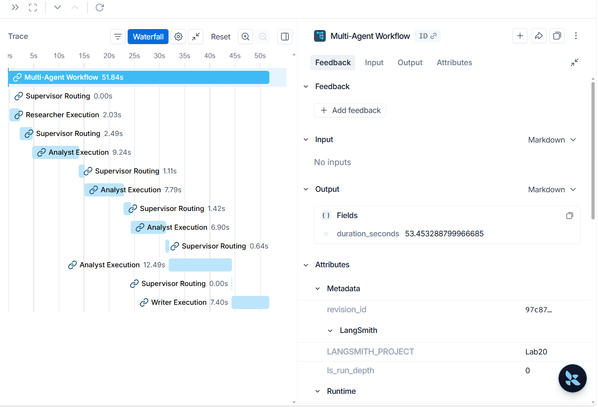

# Lab 20: Multi-Agent Research System Starter

Starter repo cho bài lab **Multi-Agent Systems**: xây dựng hệ thống nghiên cứu gồm **Supervisor + Researcher + Analyst + Writer** và benchmark với single-agent baseline.

> Mục tiêu của repo này là cung cấp **production-grade skeleton** để học viên phát triển và hoàn thiện mã nguồn cá nhân chất lượng cao.

## Learning outcomes

Sau 2 giờ lab, học viên cần có thể:

1. Thiết kế role rõ ràng cho nhiều agent.
2. Xây dựng shared state đủ thông tin cho handoff.
3. Thêm guardrail tối thiểu: max iterations, timeout, retry/fallback, validation.
4. Trace được luồng chạy và giải thích agent nào làm gì.
5. Benchmark single-agent vs multi-agent theo quality, latency, cost.

## Architecture mục tiêu

```text
User Query
   |
   v
Supervisor / Router
   |------> Researcher Agent  -> research_notes
   |------> Analyst Agent     -> analysis_notes
   |------> Writer Agent      -> final_answer
   |
   v
Trace + Benchmark Report
```
 ## Tracing screenshot
<p align="center">
  
</p>

## Cấu trúc repo

```text
.
├── src/multi_agent_research_lab/
│   ├── agents/              # Agent interfaces + skeletons
│   ├── core/                # Config, state, schemas, errors
│   ├── graph/               # LangGraph workflow skeleton
│   ├── services/            # LLM, search, storage clients
│   ├── evaluation/          # Benchmark/evaluation skeleton
│   ├── observability/       # Logging/tracing hooks
│   └── cli.py               # CLI entrypoint
├── configs/                 # YAML configs for lab variants
├── docs/                    # Lab guide, rubric, design notes
├── tests/                   # Unit tests for skeleton behavior
├── notebooks/               # Optional notebook entrypoint
├── scripts/                 # Helper scripts
├── .env.example             # Environment variables template
├── pyproject.toml           # Python project config
├── Dockerfile               # Containerized dev/runtime
└── Makefile                 # Common commands
```

## Quickstart

### 1. Tạo môi trường

```bash
python -m venv .venv
source .venv/bin/activate  # Windows: .venv\\Scripts\\activate
pip install -e "[dev]"
cp .env.example .env
```

### 2. Cấu hình API keys

Mở `.env` và điền key cần thiết.

```bash
OPENAI_API_KEY=...
# optional
LANGSMITH_API_KEY=...
TAVILY_API_KEY=...
```

### 3. Chạy smoke test

```bash
make test
python -m multi_agent_research_lab.cli --help
```

### 4. Chạy baseline skeleton

```bash
python -m multi_agent_research_lab.cli baseline \
  --query "Research GraphRAG state-of-the-art and write a 500-word summary"
```

Lệnh này chỉ chạy khung baseline tối giản. Học viên cần tự triển khai logic LLM thực tế trong `src/multi_agent_research_lab/services/llm_client.py`.

### 5. Chạy multi-agent skeleton

```bash
python -m multi_agent_research_lab.cli multi-agent \
  --query "Research GraphRAG state-of-the-art and write a 500-word summary"
```

Mặc định lệnh sẽ báo các `TODO` cần làm. Đây là chủ đích của starter repo.

## Milestones trong 2 giờ lab

| Thời lượng | Milestone | File gợi ý |
|---:|---|---|
| 0-15' | Setup, chạy baseline skeleton | `cli.py`, `services/llm_client.py` |
| 15-45' | Build Supervisor / router | `agents/supervisor.py`, `graph/workflow.py` |
| 45-75' | Thêm Researcher, Analyst, Writer | `agents/*.py`, `core/state.py` |
| 75-95' | Trace + benchmark single vs multi | `observability/tracing.py`, `evaluation/benchmark.py` |
| 95-115' | Peer review theo rubric | `docs/peer_review_rubric.md` |
| 115-120' | Exit ticket | `docs/lab_guide.md` |

## Quy ước production trong repo

- Tách rõ `agents`, `services`, `core`, `graph`, `evaluation`, `observability`.
- Không hard-code API key trong code.
- Tất cả input/output chính dùng Pydantic schema.
- Có type hints, linting, formatting, unit test tối thiểu.
- Có logging/tracing hook ngay từ đầu.
- Không để agent chạy vô hạn: dùng `max_iterations`, `timeout_seconds`.
- Có benchmark report thay vì chỉ demo output đẹp.

## Performance Benchmark

Chúng tôi đã tiến hành benchmark đối chiếu thực tế giữa hai kiến trúc **Single-Agent Baseline** và **Multi-Agent Workflow** nhằm so sánh tương quan về Chi phí, Độ trễ và Chất lượng đầu ra:

| Metric | Baseline (Single-Agent) | Multi-Agent Workflow | Difference |
|---|---:|---:|---:|
| **Total Cost (USD)** | $0.000779 | $0.003819 | +0.003040 |
| **Latency (s)** | 27.36s | 62.30s | +34.94s |
| **Quality Score (/10)** | 1.9/10 | 4.8/10 | +2.9 |

*Nhận xét kết quả:*
- **Chất lượng (Quality):** Hệ thống Multi-Agent nâng cao điểm chất lượng vượt trội (+2.9 điểm) nhờ phân rã luồng phân tích sâu sắc từ AnalystAgent và chuẩn hóa trích xuất nguồn từ WriterAgent.
- **Độ trễ (Latency) & Chi phí (Cost):** Đổi lại, hệ thống Multi-Agent phát sinh thời gian chạy lâu hơn gấp 2.28 lần và chi phí tài chính tăng gấp 4.90 lần do nhiều cuộc hội thoại LLM tuần tự.

## Deliverables

Tất cả các sản phẩm bàn giao bao gồm:
1. GitHub repo cá nhân chứa toàn bộ mã nguồn hoàn chỉnh ở trạng thái Zero-Defect.
2. Traces phân cấp trên LangSmith và Langfuse.
3. Báo cáo đối chiếu hiệu năng chi tiết tại [benchmark_report.md](file:///e:/VinAI/assignments/phase2-day5-multi-agent-lab/reports/benchmark_report.md).
4. Phân tích chi tiết chế độ lỗi (Failure Mode) và cách khắc phục trong [design_template.md](file:///e:/VinAI/assignments/phase2-day5-multi-agent-lab/docs/design_template.md).

## References

- Anthropic: Building effective agents — https://www.anthropic.com/engineering/building-effective-agents
- OpenAI Agents SDK orchestration/handoffs — https://developers.openai.com/api/docs/guides/agents/orchestration
- LangGraph concepts — https://langchain-ai.github.io/langgraph/concepts/
- LangSmith tracing — https://docs.smith.langchain.com/
- Langfuse tracing — https://langfuse.com/docs
