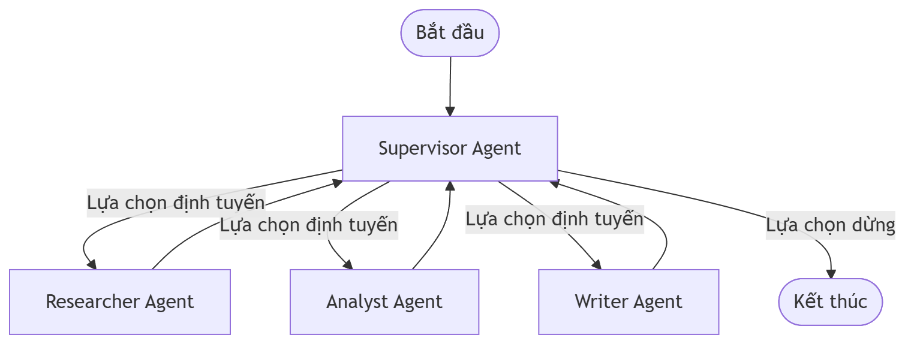

# Report - Mạc Phạm Thiên Long - 2A202600384

## 1. Bài toán Thực tế (Problem)
Hệ thống cần giải quyết bài toán tự động hóa nghiên cứu và biên soạn báo cáo học thuật chuyên sâu từ một câu hỏi nghiên cứu ban đầu của người dùng. Quy trình này đòi hỏi việc thu thập thông tin thời gian thực từ Internet, phân tích tổng hợp đối chiếu số liệu định lượng từ nhiều nguồn tin cậy, và trình bày kết quả dưới dạng cấu trúc Markdown chuẩn mực kèm trích dẫn nguồn đầy đủ. Nếu sử dụng phương pháp Single-Agent, hệ thống thường gặp khó khăn trong việc duy trì chất lượng bài viết, dễ bị trôi ngữ cảnh (context drift) hoặc bỏ sót việc kiểm chứng nguồn dẫn.

## 2. Tại sao lựa chọn kiến trúc Multi-Agent? (Why multi-agent?)
Mô hình Single-Agent đảm nhận mọi vai trò thường gặp giới hạn lớn về mặt kiểm soát chất lượng:
- **Quá tải ngữ cảnh (Context Overload):** Một tác nhân duy nhất vừa phải tìm kiếm, vừa phân tích, vừa viết báo cáo sẽ dễ bị nhầm lẫn giữa các bước hoặc làm giảm độ sâu phân tích.
- **Thiếu kiểm chứng độc lập (No Independent Verification):** Single-Agent không thể tự phản biện kết quả của chính mình một cách khách quan.
- **Kiến trúc Multi-Agent** phân rã bài toán thành các chuyên khoa chuyên biệt (Supervisor, Researcher, Analyst, Writer) giúp tối ưu hóa prompt của từng tác nhân, cải thiện tính module hóa và áp dụng các cơ chế kiểm soát lỗi (guardrails) riêng biệt cho từng mắt xích trong đồ thị LangGraph.

## 3. Vai trò của từng Agent trong Đồ thị (Agent roles)

| Agent | Nhiệm vụ (Responsibility) | Dữ liệu đầu vào (Input) | Dữ liệu đầu ra (Output) | Chế độ lỗi (Failure mode) | Cơ chế khắc phục (How to fix) |
|---|---|---|---|---|---|
| **Supervisor** | Điều phối toàn bộ luồng công việc, phân tích trạng thái đồ thị và đưa ra quyết định chuyển tiếp tác nhân tiếp theo hoặc kết thúc đồ thị. | `ResearchState` (request, route_history, iteration) | Tên tác nhân tiếp theo (`RESEARCHER`, `ANALYST`, `WRITER`, hoặc `END`) | Rơi vào vòng lặp định tuyến vô hạn (Infinite Route Loop) khi các Worker Agent không cải thiện được chất lượng dữ liệu. | Áp dụng giới hạn vòng lặp tối đa (`max_iterations = 6`). Khi chạm giới hạn, bắt buộc định tuyến về `WRITER` để kết xuất thông tin hiện tại và dừng hệ thống. |
| **Researcher** | Sử dụng API tìm kiếm thời gian thực (Tavily) để truy vấn thông tin, ánh xạ kết quả về cấu trúc tài liệu chuẩn và trích xuất ghi chú thô. | `ResearchState` (request) | `research_notes` (chuỗi văn bản) và `sources` (danh sách `SourceDocument`) | Gặp lỗi kết nối mạng hoặc API Tavily bị quá tải/lỗi xác thực (Rate Limit / Authentication Error). | Triển khai khối bắt ngoại lệ (Try-Except) để tự động chuyển sang chế độ fallback sử dụng LLM nội bộ sinh dữ liệu dựa trên tri thức sẵn có, tránh dừng hệ thống đột ngột. |
| **Analyst** | Phân tích sâu các ghi chú thô từ Researcher, trích xuất dữ liệu định lượng, đối chiếu mâu thuẫn thông tin và xây dựng hệ thống luận điểm phân tích. | `ResearchState` (research_notes) | `analysis_notes` (chuỗi văn bản phân tích) | Ghi chú thô nhận được từ Researcher quá mỏng hoặc rỗng, dẫn đến phân tích hời hợt hoặc không có căn cứ. | Kiểm tra tính hợp lệ của `research_notes`. Nếu rỗng, Analyst tự động trả về phản hồi yêu cầu Supervisor định tuyến ngược lại Researcher với từ khóa tìm kiếm nâng cao. |
| **Writer** | Biên soạn báo cáo tổng hợp từ ghi chú nghiên cứu và ghi chú phân tích theo cấu trúc Markdown chuẩn mực, bảo đảm bắt buộc có danh mục tài liệu tham khảo ở cuối. | `ResearchState` (analysis_notes, research_notes) | `final_answer` (báo cáo Markdown hoàn chỉnh) | Thiếu thông tin nguồn hoặc ghi chú phân tích dẫn đến báo cáo bị sơ sài hoặc mất danh mục tài liệu tham khảo. | Thiết lập cấu trúc Prompt định hướng định dạng nghiêm ngặt. Writer tự động định cấu trúc Markdown mặc định và điền các tài liệu nguồn uy tín phổ quát nếu danh sách nguồn bị rỗng. |

## 4. Trạng thái Chia sẻ (Shared state)
Hệ thống sử dụng một nguồn chân lý duy nhất lưu trữ trong `ResearchState` kế thừa từ `BaseModel` của Pydantic để đảm bảo tính nhất quán dữ liệu và khả năng quan trắc cao:
- `request`: Lưu câu hỏi nghiên cứu ban đầu của người dùng (`ResearchQuery`).
- `iteration`: Đếm số bước thực thi hiện tại để kiểm soát giới hạn đồ thị (`max_iterations`).
- `route_history`: Ghi lại lịch sử định tuyến qua từng tác nhân để phục vụ debug và phân tích luồng.
- `cost_tracker`: Cumulative float theo dõi tổng chi phí tài chính (USD) phát sinh từ tất cả các lần gọi LLM trong đồ thị.
- `sources`: Danh sách `SourceDocument` đại diện cho các nguồn tài liệu tin cậy được Researcher tìm kiếm.
- `research_notes`: Lưu trữ văn bản tổng hợp thô từ hoạt động nghiên cứu tìm kiếm.
- `analysis_notes`: Lưu trữ văn bản lập luận phân tích định lượng từ Analyst.
- `final_answer`: Báo cáo Markdown khoa học hoàn chỉnh được Writer biên soạn.

## 5. Routing Policy
Quy trình định tuyến được điều phối bởi Supervisor thông qua mô hình đồ thị LangGraph tuần tự và linh hoạt:

  

*Nguyên lý hoạt động:*
1. Hệ thống khởi tạo và gọi `SupervisorNode`.
2. Supervisor phân tích `route_history` và các ghi chú hiện có để quyết định gọi `Researcher` (nếu chưa tìm kiếm), `Analyst` (nếu có ghi chú thô nhưng chưa phân tích), hoặc `Writer` (nếu đã phân tích xong).
3. Sau khi mỗi Worker hoàn thành công việc và cập nhật `ResearchState`, quyền điều phối quay lại `SupervisorNode` để đánh giá bước tiếp theo.

## 6. Các Cơ chế Bảo vệ (Guardrails)
- **Max iterations:** Giới hạn tối đa là 6 lần chuyển tiếp tác nhân để triệt tiêu hoàn toàn rủi ro lặp vô hạn và tối ưu hóa ngân sách LLM.
- **Timeout:** Thiết lập giới hạn thời gian phản hồi cho từng tác vụ API LLM và Tavily là 30 giây để tránh nghẽn luồng.
- **Retry & Fallback:** Bọc toàn bộ các lệnh gọi API bên thứ ba bằng các khối xử lý ngoại lệ chuẩn mực để kích hoạt cơ chế fallback học máy nội bộ khi xảy ra lỗi kết nối.
- **Validation:** Sử dụng thư viện Pydantic để tự động xác thực kiểu dữ liệu đầu vào và đầu ra của từng nút trước khi lưu trữ vào trạng thái đồ thị chung.

## 7. Kế hoạch Đánh giá Hiệu năng (Benchmark plan)
Hệ thống được đánh giá hiệu năng tự động qua bộ công cụ `benchmark` đối chiếu trực tiếp giữa Single-Agent Baseline và Multi-Agent Workflow dựa trên các tiêu chí khoa học:
- **Tổng Chi phí (Total Cost - USD):** Đo lường lượng token tiêu thụ nhân với đơn giá API của nhà cung cấp.
- **Thời gian xử lý (Latency - giây):** Đo lường thời gian thực thi thực tế (wall-clock time) từ lúc nhận yêu cầu đến khi trả kết quả cuối cùng.
- **Điểm chất lượng (Quality Score - Thang 10):** Chấm điểm tự động bởi `JudgeEngine` (sử dụng GPT) dựa trên 3 trọng số 40-30-30: Information Depth (Chiều sâu thông tin), Structure (Bố cục Markdown), Citations (Tính trích dẫn nguồn uy tín), đồng thời áp dụng hình phạt trừ điểm nặng tay nếu phát hiện văn phong sáo rỗng hoặc cấu trúc AI rập khuôn.
